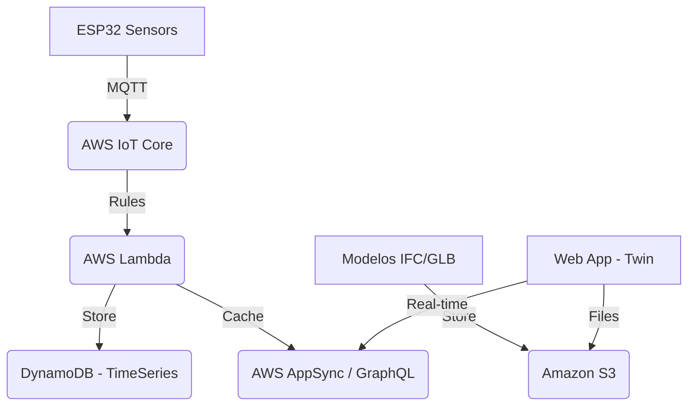

# AWS MIGRATION ROADMAP: REDONDOS VANGUARD ☁️🚀

Estrategia para escalar el Gemelo Digital a nivel industrial y multi-sede.

## 🏛️ Arquitectura Propuesta

## 📅 Fases de Migración

### Fase 1: Ingesta (IoT Core)
- Configuración de certificados X.509 en los ESP32.
- Definición de Topics y Reglas de enrutamiento.

### Fase 2: Almacenamiento & Analítica (Lambda & S3)
- Procesamiento de "Toses" mediante Lambda para generar alertas.
- Guardado de estados históricos para gráficas de KPI.
- Migración de modelos BIM a S3 para carga dinámica.

### Fase 3: Multi-Sede & Seguridad
- Implementación de **AWS Cognito** para diferentes roles (Admin, Veterinario, Gerente).
- Dashboard dinámico basado en la ubicación geográfica (Multi-Granja).

## 💰 Estimación de Costos (Free Tier Friendly)
- **IoT Core**: ~S/ 4.00 mensualmente (bajo volumen).
- **S3 & DynamoDB**: Dentro del Capa Gratuita inicialmente.
- **Next.js Hosting**: AWS Amplify or Vercel.
